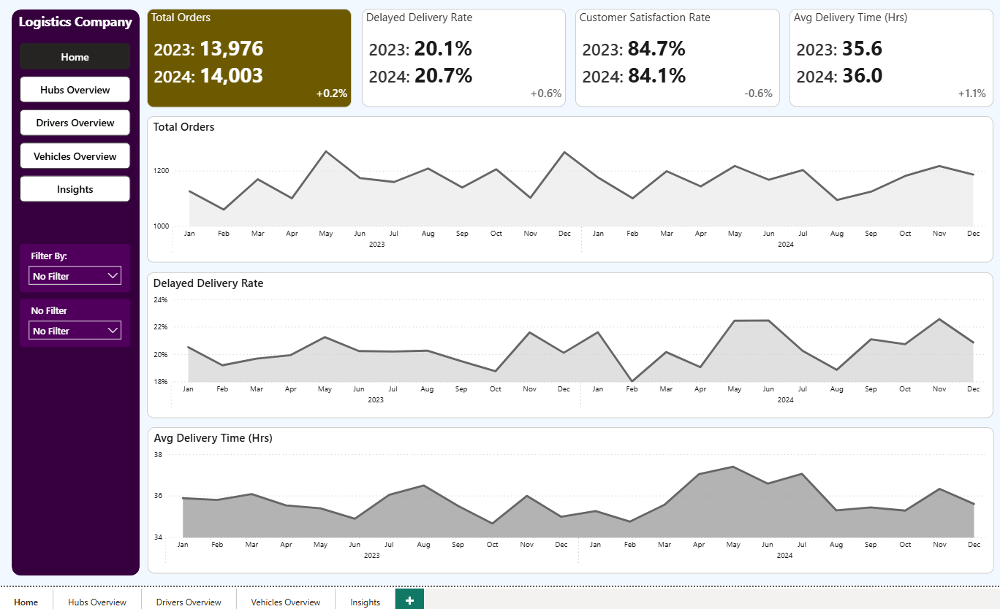
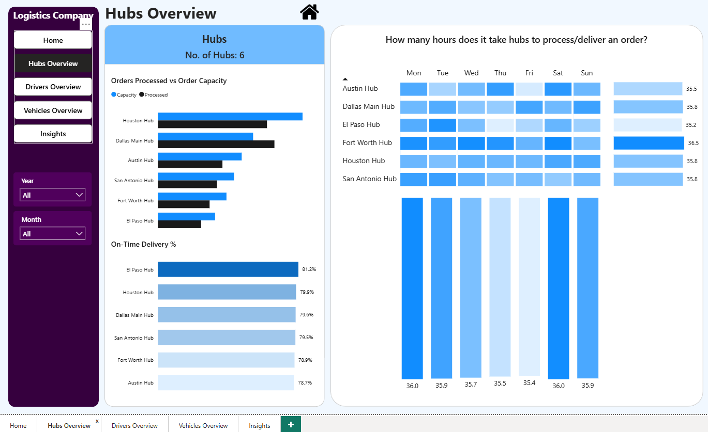
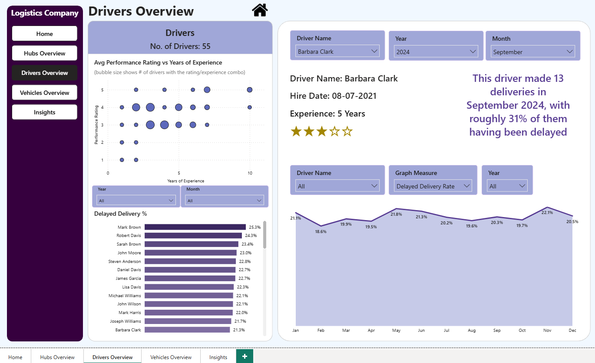
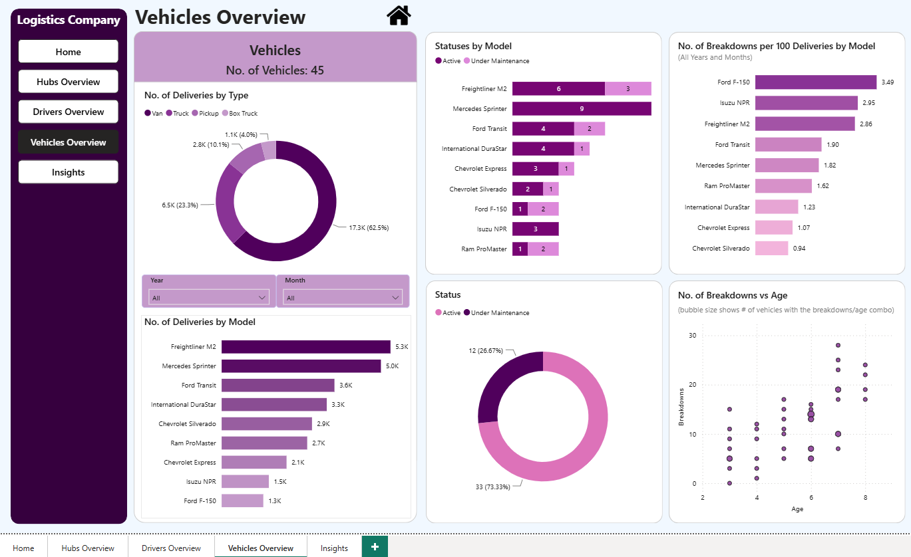
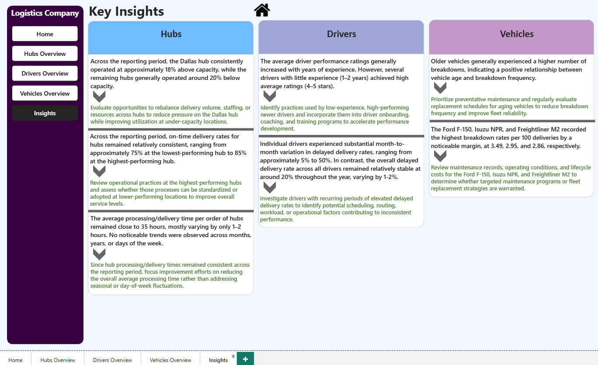
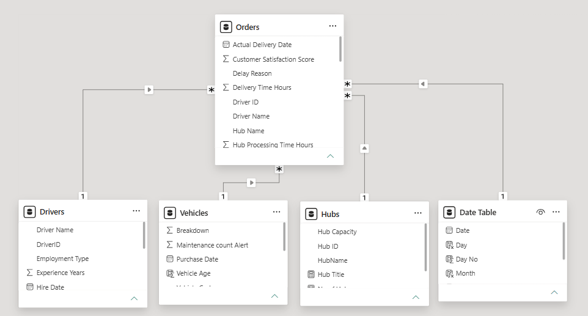

# Logistics Company Operations Report

A Power BI report for a fictional logistics company that analyzes hub performance, driver performance, and fleet reliability.

## Project Overview

This project demonstrates the design and development of an interactive Power BI report for a fictional logistics company. The report consolidates operational data from logistics hubs, delivery drivers, and vehicle models into a centralized reporting solution that supports performance monitoring and data-driven decision making.

The report combines interactive visualizations, hierarchical drill-down capabilities, DAX measures, Power Query transformations, and an optimized data model to provide insights into hub utilization/performance, delivery driver performance, and vehicle fleet usage/reliability.

---

## Business Problem and Objectives 

A logistics company requires greater visibility into the performance of its hubs, delivery drivers, and vehicle fleet. Without centralized reporting, identifying operational inefficiencies, capacity imbalances, delivery performance trends, and vehicle reliability issues becomes difficult.

- Which hubs, drivers, and vehicle models are performing below expectations?
- Are there underlying operational or external factors that influence performance across the organization?
- What opportunities exist to improve operational efficiency, delivery performance, and fleet reliability?

---

## Viewing the Report

This project is provided as a Power BI Desktop (.pbix) file and is intended to be viewed locally using Power BI Desktop.

To explore the dashboard:
1. Download the Logistics LogisticsCompanyReport.pbix file from this repository
2. Open the file using Power BI Desktop
3. Navigate between report pages using the navigation buttons
4. Use the interactive slicers and visuals to explore the dashboard and its insights

Note: Power BI Desktop is available as a free download from Microsoft

---

## Dataset

This project is based on a fictional logistics operations dataset consisting of four primary tables:

- Drivers (ID, name, experience, rating…)
- Hubs (ID, name, order capacity…)
- Orders (ID, driver ID, order date, delivery date, hub ID, delay indicator, vehicle ID, delivery/processing time…)
- Vehicles (ID, vehicle age, breakdowns…)

The dataset contains operational records covering the 2023 and 2024 calendar years.

The original sample dataset was obtained from a publicly available Power BI dataset provided by Rishav Sinha (an online data analytics educator) and was used as the starting point for this project.

Building upon that dataset, I independently designed the data model, performed Power Query transformations, developed DAX measures, built the interactive dashboard, and generated the business insights and recommendations presented throughout the report.

---

## Overview of Dashboards

### Home Dashboard

Provides an overview of the company's operational performance across the 2023 and 2024 calendar years. 

As the primary landing page of the report, it allows users to quickly assess key performance indicators and identify operational trends before exploring more detailed analyses on the Hubs, Drivers, Vehicles, and Insights pages.

Key Features
- The navigation buttons on the left side enable users to move seamlessly between report pages 
- The top slicer on the left allows users to filter all graphs and KPIs by a specific hub, driver, or vehicle model, or to view company-wide results without applying a filter
- The bottom slicer on the left responds to the top one, and lets users select which hub, driver, or vehicle model to filter by 
- All 3 graphs have hierarchical drill-down capabilities

### Hubs Dashboard

Provides a detailed analysis of the company's logistics hubs across the 2023 and 2024 calendar years, or over a user-selected time period. This page enables users to evaluate hub capacity, performance, and operational efficiency, helping identify operational bottlenecks and opportunities for improvement.

Key Features
- The year and month slicers on the left allow users to analyze hub performance over a user-selected time period, or across the full 2 year reporting period
- The heat map visualizes average processing and delivery times by hub and day of the week, where darker shades indicate longer processing/delivery times
- The summary bars of the heat map dynamically adjust in both length and shade based on the corresponding average processing/delivery times
  
### Drivers Dashboard

Provides a detailed analysis of the company's delivery drivers across the 2023 and 2024 calendar years, or over a user-selected time period. This page enables users to evaluate driver performance/ratings, experience, and delivery reliability, helping identify performance trends and opportunities for improvement.

Key Features
- The performance ratings vs years of experience plot is not affected by any slicers, and is for all drivers over both calendar years
- The Year and month slicers on the left panel of the page affect the bar chart below it, and allow users to analyze driver performance over a user-selected time period, or across the full 2 year reporting period
- The three slicers at the top of the page’s right panel affect the two text visuals below it, allowing the user to see some of the selected driver’s information, as well as their delivery volume and delayed delivery rate for the selected month and year
- The bottom 3 slicers on the right panel affect the area chart below, allowing the user to analyze monthly trends for a selected driver, performance measure, and calendar year(s)
  
### Vehicles Dashboard

Provides a detailed analysis of the company's vehicle fleet across the 2023 and 2024 calendar years, or over a user-selected time period. This page enables users to evaluate vehicle utilization, reliability, and maintenance performance, helping identify trends and opportunities to improve fleet efficiency.

Key Features
- The Year and month slicers on the left panel affect only the donut and bar chart, which allows the user to analyze the breakdown of deliveries by vehicle type and model over a user-selected time period, or across the full 2 year reporting period
- The remaining 4 visuals are static, and for the full 2 year reporting period

### Insights Dashboard

Summarizes the most significant findings identified throughout the dashboard analysis and presents corresponding recommendations to support data-driven operational decision-making. This page consolidates insights across logistics hubs, delivery drivers, and the vehicle fleet into a single executive summary.

Key Features
- Organizes findings into dedicated Hubs, Drivers, and Vehicles sections for easy interpretation
- Pairs every business insight with a corresponding recommendation (in green text) to support operational decision-making

---

## Technical Implementation

### Data Preparation

The original dataset was provided as four CSV files (Drivers, Hubs, Orders, and Vehicles). Each file was initially reviewed in Microsoft Excel, converted into an Excel Table, and imported into Power BI.

Power Query was then used to prepare the data for analysis by:
- Validating and assigning appropriate data types 
- Removing unnecessary columns 
- Removing duplicate records 
- Replacing null values 
- Cleaning and trimming text values 

These transformations ensured the dataset was accurate, consistent, and ready for data modeling and analysis.

### Data Modeling

Following data preparation, a relational data model was designed to support efficient filtering, aggregation, and time-based analysis across the dashboard.

The model consists of one central fact table (Orders) connected to four dimension tables (Drivers, Hubs, Vehicles, and a dedicated Date Table). All relationships were manually created using one-to-many, single-direction relationships, resulting in a clean and scalable model architecture.

To support robust time-intelligence analysis, a dedicated Date table was created using DAX and linked to the Orders table. This enabled monthly trend analysis, year-over-year comparisons, and consistent date filtering throughout the report.

### DAX Measures

Custom DAX measures were developed to support the dashboard's key performance indicators, operational metrics, percentage calculations, trend analysis, and dynamic report functionality. These measures power the interactive visuals, executive KPIs, and time-based analyses presented throughout the report.

Representative measures include:
- Total orders 
- Total deliveries 
- Delayed delivery rate 
- On-time delivery rate 
- Average delivery time 
- Breakdowns per 100 deliveries 
- Vehicle age 
- Customer satisfaction %
- Hub capacity scaled by user selected time-period
- Several dynamic text measures for displaying contextual information 

---

## Conclusion 

This report successfully addresses the original business problem, culminating in a dedicated insights page that consolidates the dashboard's key findings and recommendations into a single executive summary. Through interactive analysis an executive-level reporting, it provides a centralized view of logistics hub performance, driver performance, and vehicle reliability, enabling users to identify operational bottlenecks, monitor key performance indicators, and uncover opportunities to improve capacity planning, delivery performance, and fleet management.

---

## Acknowledgements

The fictional logistics dataset used in this project was obtained from a publicly available Power BI dataset created by Rishav Sinha
https://drive.google.com/drive/folders/17KcO04dPNRjJUaACV-ZSH1Iz7d_ibKn5

